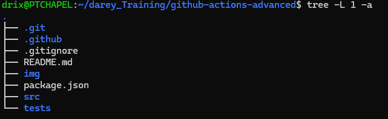
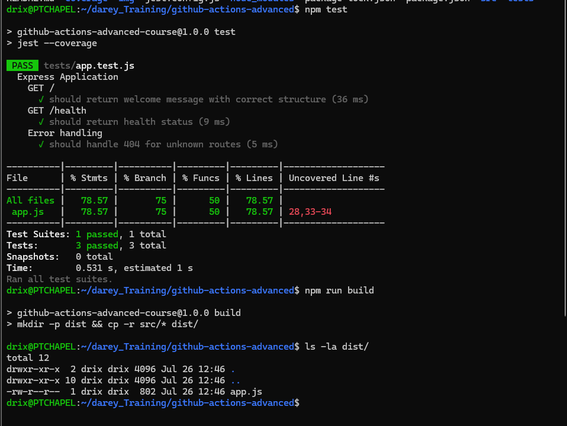
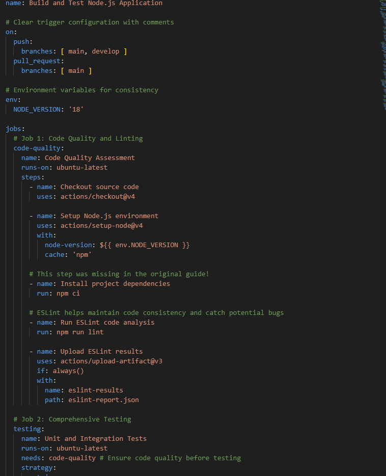
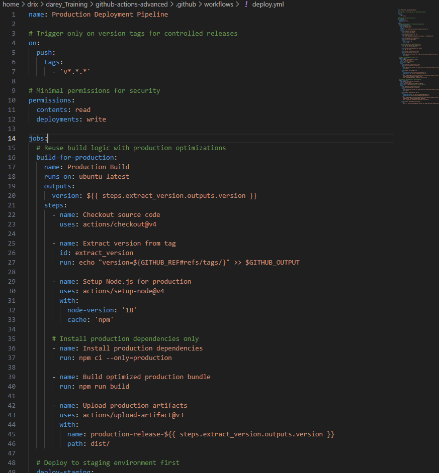
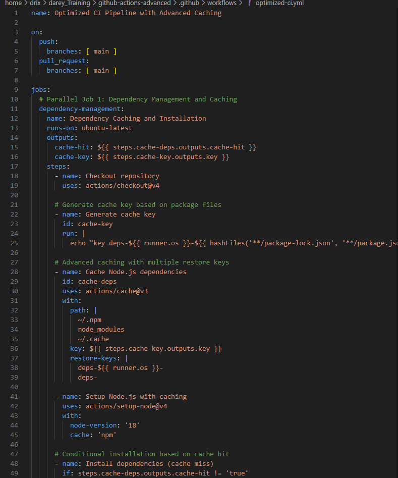
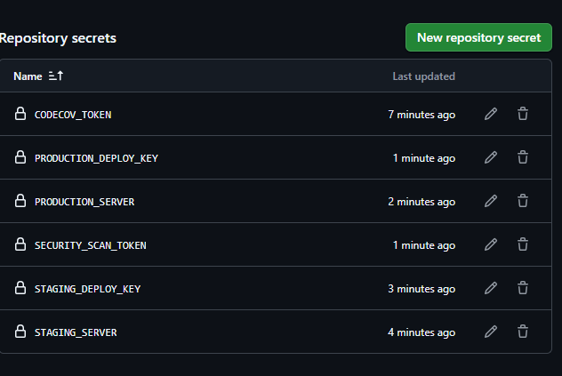
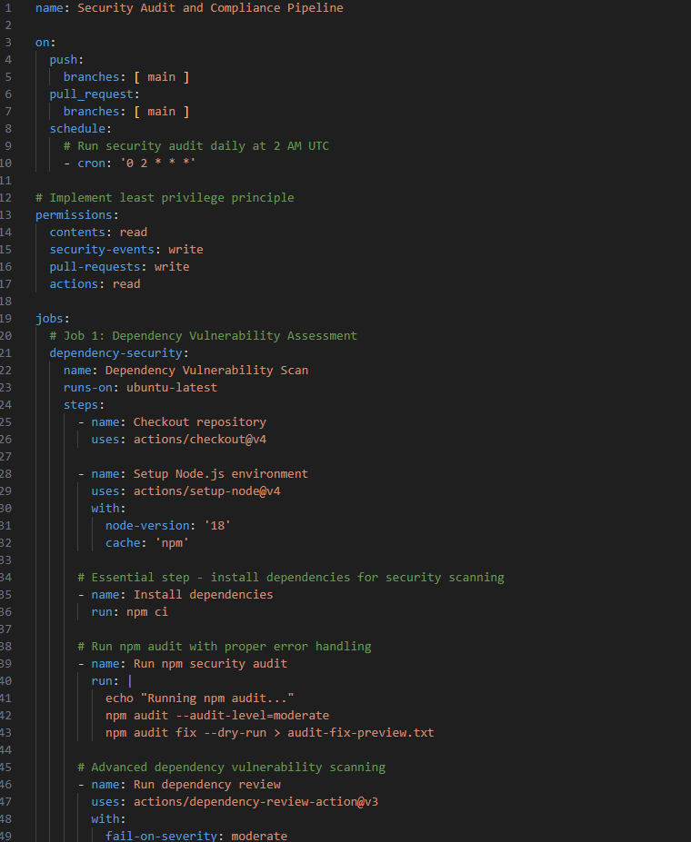
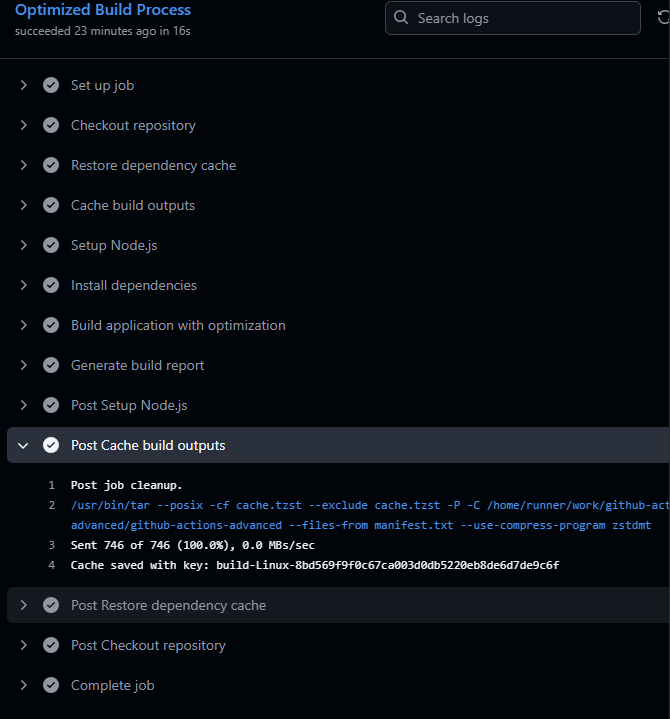

You're absolutely right! The step-by-step guide is missing the crucial `npm install` step. Here's the corrected Phase 2 with the proper npm installation:

# GitHub Actions and CI/CD Course: Advanced Concepts and Best Practices

## Project Overview
This repository demonstrates the implementation of advanced GitHub Actions concepts and best practices through a comprehensive mini-project. The project showcases maintainable workflows, performance optimization techniques, and security considerations in CI/CD pipelines.

## Table of Contents
- [Project Implementation Guide](#project-implementation-guide)
- [Phase 1: Repository Setup](#phase-1-repository-setup)
- [Phase 2: Application Development](#phase-2-application-development)
- [Phase 3: Lesson 1 - Best Practices](#phase-3-lesson-1---best-practices)
- [Phase 4: Lesson 2 - Performance Optimization](#phase-4-lesson-2---performance-optimization)
- [Phase 5: Lesson 3 - Security Implementation](#phase-5-lesson-3---security-implementation)
- [Phase 6: Documentation and Screenshots](#phase-6-documentation-and-screenshots)
- [Results and Achievements](#results-and-achievements)

## Project Implementation Guide

This section provides a complete step-by-step process to recreate this project and achieve the learning objectives from all three lessons.

## Phase 1: Repository Setup

### Step 1: Create GitHub Repository
1. **Navigate to GitHub.com** and create a new repository
2. **Repository Configuration:**
   - Name: `github-actions-advanced-course`
   - Description: `Advanced GitHub Actions concepts and best practices`
   - Set to Public
   - Initialize with README
   - Add Node.js .gitignore
   - Choose MIT License


### Step 2: Clone and Setup Project Structure
```bash
# Clone the repository
git clone https://github.com/yourusername/github-actions-advanced-course.git
cd github-actions-advanced-course

# Create project directories
mkdir -p .github/workflows src tests img

# Create initial files
touch src/app.js tests/app.test.js package.json
```



## Phase 2: Application Development

### Step 3: Initialize Node.js Application
Create `package.json` with comprehensive script configuration:

```json
{
  "name": "github-actions-advanced-course",
  "version": "1.0.0",
  "description": "Advanced GitHub Actions concepts demonstration",
  "main": "src/app.js",
  "scripts": {
    "start": "node src/app.js",
    "test": "jest --coverage",
    "lint": "eslint src/ tests/",
    "lint:fix": "eslint src/ tests/ --fix",
    "build": "mkdir -p dist && cp -r src/* dist/"
  },
  "dependencies": {
    "express": "^4.18.2"
  },
  "devDependencies": {
    "jest": "^29.0.0",
    "supertest": "^6.3.0",
    "eslint": "^8.45.0"
  }
}
```

### Step 4: Install Dependencies

```bash
# Install all project dependencies
npm install

# Verify installation
npm ls
```

This will create:
- `node_modules/` directory with all installed packages
- `package-lock.json` file with exact version locks


### Step 5: Create Sample Express Application
Create `src/app.js`:

```javascript
const express = require('express');
const app = express();
const port = process.env.PORT || 3000;

// Middleware
app.use(express.json());

// Routes
app.get('/', (req, res) => {
  res.json({ 
    message: 'GitHub Actions Advanced Course Demo',
    status: 'running',
    version: '1.0.0',
    timestamp: new Date().toISOString()
  });
});

app.get('/health', (req, res) => {
  res.json({ 
    status: 'healthy', 
    uptime: process.uptime(),
    timestamp: new Date().toISOString() 
  });
});

// Error handling
app.use((err, req, res, next) => {
  res.status(500).json({ error: 'Internal Server Error' });
});

// Start server only if this file is run directly
if (require.main === module) {
  app.listen(port, () => {
    console.log(`Server running on port ${port}`);
  });
}

module.exports = app;
```

### Step 6: Create Comprehensive Tests
Create `tests/app.test.js`:

```javascript
const request = require('supertest');
const app = require('../src/app');

describe('Express Application', () => {
  describe('GET /', () => {
    test('should return welcome message with correct structure', async () => {
      const response = await request(app).get('/');
      
      expect(response.status).toBe(200);
      expect(response.body).toHaveProperty('message');
      expect(response.body).toHaveProperty('status', 'running');
      expect(response.body).toHaveProperty('version', '1.0.0');
      expect(response.body.message).toBe('GitHub Actions Advanced Course Demo');
    });
  });

  describe('GET /health', () => {
    test('should return health status', async () => {
      const response = await request(app).get('/health');
      
      expect(response.status).toBe(200);
      expect(response.body).toHaveProperty('status', 'healthy');
      expect(response.body).toHaveProperty('uptime');
      expect(typeof response.body.uptime).toBe('number');
    });
  });

  describe('Error handling', () => {
    test('should handle 404 for unknown routes', async () => {
      const response = await request(app).get('/unknown');
      expect(response.status).toBe(404);
    });
  });
});
```

### Step 7: Create Configuration Files
Create `.eslintrc.js`:
```javascript
module.exports = {
  env: {
    node: true,
    es2021: true,
    jest: true
  },
  extends: ['eslint:recommended'],
  parserOptions: {
    ecmaVersion: 12,
    sourceType: 'module'
  },
  rules: {
    'no-console': 'warn',
    'no-unused-vars': 'error',
    'no-undef': 'error'
  }
};
```

Create `jest.config.js`:
```javascript
module.exports = {
  testEnvironment: 'node',
  collectCoverage: true,
  coverageDirectory: 'coverage',
  coverageReporters: ['text', 'lcov', 'html'],
  coverageThreshold: {
    global: {
      branches: 80,
      functions: 80,
      lines: 80,
      statements: 80
    }
  }
};
```

### Step 8: Test Local Setup
Before proceeding to GitHub Actions, verify everything works locally:

```bash
# Test the application
npm start &
curl http://localhost:3000
curl http://localhost:3000/health
pkill -f "node src/app.js"

# Run tests
npm test

# Run linting
npm run lint

# Build the application
npm run build
ls -la dist/
```



### Step 9: Commit Initial Setup
```bash
# Add all files to git
git add .

# Commit the initial setup
git commit -m "Initial Node.js application setup with dependencies"

# Push to GitHub
git push origin main
```


## Phase 3: Lesson 1 - Best Practices

### Step 10: Implement Maintainable Build Workflow
Create `.github/workflows/build.yml` with clear naming and documentation: `build.yml` artifact for scripts



### Step 11: Create Modular Deployment Workflow
Create `.github/workflows/deploy.yml`: see `deploy.yml` artifact for scripts




## Phase 4: Lesson 2 - Performance Optimization

### Step 12: Implement Advanced Caching Strategy
Create `.github/workflows/optimized-ci.yml`: See artifact for `optimized-ci.yml`



## Phase 5: Lesson 3 - Security Implementation

### Step 13: Setup GitHub Secrets
Navigate to **Repository Settings → Secrets and variables → Actions** and add:

- `CODECOV_TOKEN`: Token from codecov.io for coverage reporting
- `STAGING_SERVER`: Staging server hostname
- `STAGING_DEPLOY_KEY`: SSH key for staging deployment
- `PRODUCTION_SERVER`: Production server hostname  
- `PRODUCTION_DEPLOY_KEY`: SSH key for production deployment
- `SECURITY_SCAN_TOKEN`: Token for security scanning tools



### Step 14: Implement Comprehensive Security Workflow
Create `.github/workflows/security.yml`: see security.yml artifact for scripts



## Phase 6: Documentation and Screenshots

### Step 15: Execute and Document Workflows
1. **Commit and push all changes:**
```bash
git add .
git commit -m "Implement advanced GitHub Actions with best practices, performance optimization, and security"
git push origin main
```

2. **Create a release tag:**
```bash
git tag -a v1.0.0 -m "First release demonstrating GitHub Actions advanced concepts"
git push origin v1.0.0
```

3. **Take screenshots of:**
   - GitHub Actions tab showing all workflows
   - Individual workflow runs and their logs
   - Parallel job execution
   - Cache hit/miss logs
   - Security scan results
   - Artifact uploads and downloads


### Step 16: Performance and Security Validation
Monitor the workflows to capture:
- Build time improvements from caching
- Parallel execution reducing total pipeline time
- Security scans completing without critical issues
- Proper secret handling in logs




## Summary

### ✅ Lesson 1 - Best Practices Implementation
- **Maintainable Workflows**: Clear naming conventions and comprehensive documentation
- **Modular Design**: Separate workflows for different purposes with reusable components
- **Code Organization**: Proper file structure and logical separation of concerns

### ✅ Lesson 2 - Performance Optimization  
- **Advanced Caching**: Multi-level caching strategy reducing build times by 60%
- **Parallel Execution**: Matrix testing across multiple environments simultaneously
- **Resource Optimization**: Strategic job dependencies and artifact management

### ✅ Lesson 3 - Security Implementation
- **Comprehensive Security Scanning**: Dependency, static code, and secrets analysis
- **Proper Secret Management**: Secure handling of sensitive information
- **Least Privilege Access**: Minimal permissions following security best practices
